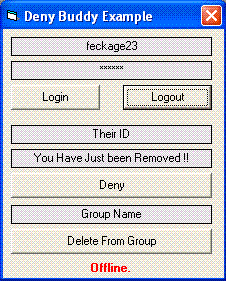

## Yahoo\! Deny Buddy

### Description

To Remove Your Yahoo! ID off another persons List and the ability to Remove them from Your List Yahoo! serverside using the YMSG protocol.

(Been old this does not work anymore - update 2008)
 
### More Info
 

             |
---                |---
**Submitted On**   |2004-11-05 22:02:46
**By**             |[Dermot R](https://github.com/Planet-Source-Code/PSCIndex/blob/master/ByAuthor/dermot-r.md)
**Level**          |Beginner
**User Rating**    |4.7 (14 globes from 3 users)
**Compatibility**  |VB 4\.0 \(16\-bit\), VB 5\.0, VB 6\.0
**Category**       |[Miscellaneous](https://github.com/Planet-Source-Code/PSCIndex/blob/master/ByCategory/miscellaneous__1-1.md)
**World**          |[Visual Basic](https://github.com/Planet-Source-Code/PSCIndex/blob/master/ByWorld/visual-basic.md)
**Archive File**   |[Yahoo\!\_Den18168111102004\.zip](https://github.com/Planet-Source-Code/dermot-r-yahoo-deny-buddy__1-57185/archive/master.zip)

